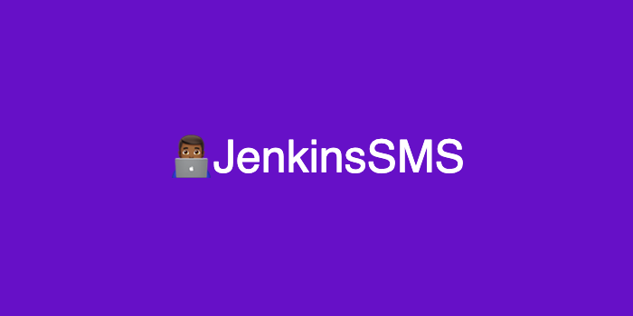
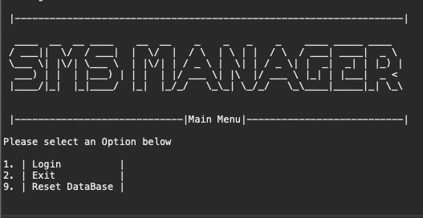

# Jenkins SMS 

## Description 

The JenkinsSms is a command line Application giving users the ability to log in review all current courses 
and register for more courses.
JenkinsSMS was made in Java, using Maven, Hibernate, and Junit for testing.
## Installation

Please Configure the hibernate.cfg.xml file accordingly.

```java
 <property name="connection.driver_class">com.mysql.cj.jdbc.Driver </property>
 <property name="connection.url">jdbc:mysql://localhost:3306/smsdb?createDatabaseIfNotExist=true</property>
 <property name="connection.username">root </property>
 <property name=“connection.password">belikewater </property>
```

## Usage
Simply run the main method located in src/main/java -> SMSRunner.java.
The database will automatically be created.
The database will automatically be seeded.




## Key features

| Allows users to login

| View all available courses 

| Register for a course

| login as a different user

| Reset the database

## Tests
testValidateStudent() is a Junit test to determine if the current student credentials are valid.
Junit test can be accessed through src/test/java --> SMSRunnerTest.java


## Stack

Java

SQL

Maven

Hibernate


